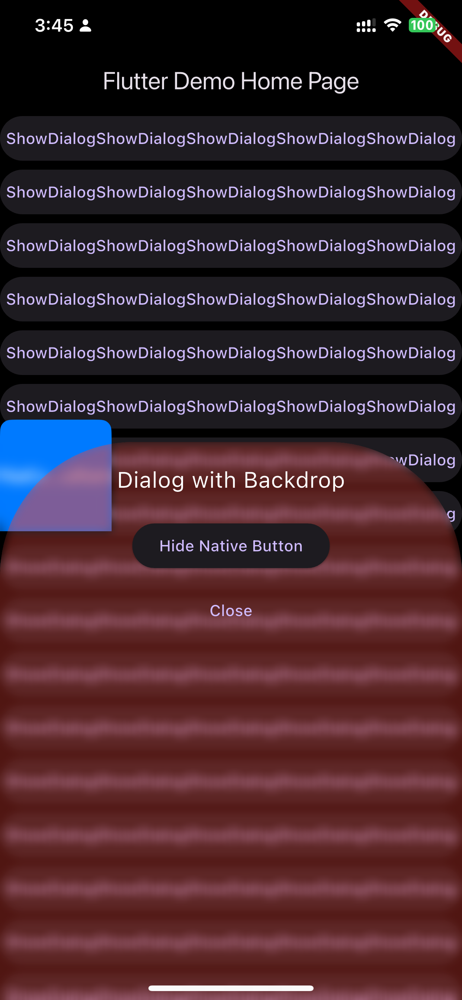
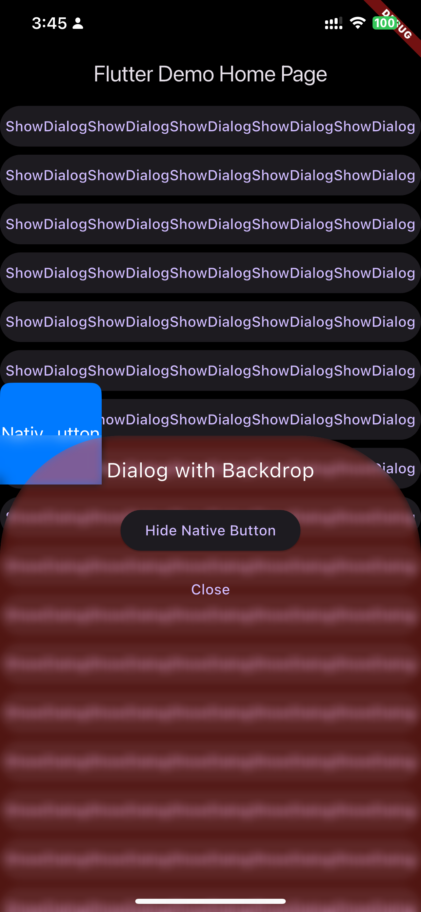
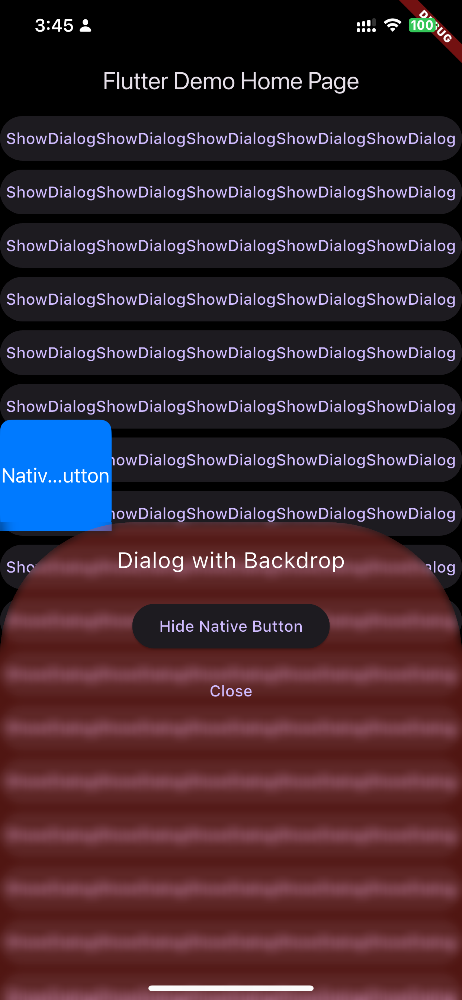

# uikitview_with_backdrop_filter

A Flutter project demonstrating UIKitView with backdrop filter effects.

## Screenshots

## Environment

- Flutter 3.29.0

## Features

- Dark theme UI
- Native iOS button integration using UIKitView
- Backdrop filter effect with blur
- Modal bottom sheet with transparency